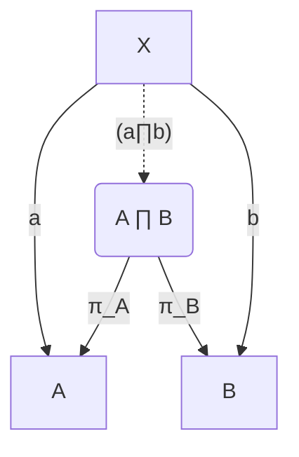

# FP in Python made Easier


---
### Programming in FP Style

If you want to program in FP style, there are three options:
- use a FP language, e.g. Haskell,
- use the functional subset of a not-specifically-FP language, or
- use that functional subset augmented with a library which offers more FP affordances.

---

### But Perhaps you need to Fit In

Reasons to choose a non-FP language:
- its a requirement of your workplace,
- you need to share your code with others (who don't use FP languages),
- there are libraries in it that you want to use,
- you know it better than you know an FP language,
- you like better than you like any FP language.

---

### Or need to Write Non-FP Code too

Sometimes, you want to write FP where that is easy, but do other parts of the code in a non-FP style, e.g. object-oriented, continuation-passing style, or even purely iterative.

---

## FP Functionality in Python

So we have chosen:
- to use Python,
- but we want an FP library,
so we can feel like we are programming an FP language.
---
## Functional Pieces of Python

---
### Function Definition

There are two ways of defining functions in Python

```python
def f_def(x,y,z):
  return x*y+z
```

```python
f_lambda = lambda x, y, z: x*y+z
```
---
## Tools for Writing our Library

---
### Argument Arrays in Function Definitions

```python
def f( *args ):
	print( args )
```

```python
f = lambda *args: len( args )

print( f(1,3,5,7) ) ## Prints 4
```
---
### Argument Arrays in Function Calls

```python
print( f( 1, 2, 3 ) ) ## Prints 3
## but we can also write this as
print( f( *[1,2,3] ) ) ## Prints 3
## or
print( f( *(1,2,3) ) ) ## Prints 3
```
---
### Inspecting Function Arity

```python
from inspect import signature
arity = lambda func: len( signature(func).parameters )
## returns the arity of function f
f = lambda x, y, z: x*y+z
print( arity(f) ) ## prints 3
```
---
### Wrapping Functions

We will use a class initialiser as a decorator to turn  functions into our extended function class:

```python
f_lambda = F( lambda x, y, z: x*y+z )

@F
def f_def(x,y,z):
  return x*y+z
```
---
## The Functional Library

We define a functional library as a module.

It's production name is `tmefunc` after its author, but the version described here is `tmefunc7`.

---
## Basic Components

---
### The Function-Wrapping Class

```python
class F:
  def __init__( self, f ): # f is a Python function
    self.F = f 
    self.L = arity( f )
```
---
#### Using `F`

As noted above, we can call this initialiser by using the class name like a function:

```python
f_lambda = F( lambda x, y, z: x*y+z )

def raw_f(x,y,z)
  return x*y+z
f_def = F( raw_f )
```

or as a decorator:
```python
@F
def f_def(x,y,z):
  return x*y+z
```
---
### Using an Object in `F` as a Function

Classes can define a method `__call__(self,*args)` to let instances behave like functions.
The most basic way we could use this would be:

```python
class F:
  # ...
  def __call__(self,*args):
    return self.F( *args )
```
which calls the function wrapped in `F` with the arguments given to it.

But we can do better.

---
### (Auto)Currying 1

Currying is the shift of an argument from being a component of a product in the domain of a function to a domain of the result of a function, e.g. turning $f: A\times B \rightarrow C$ into $f' : A \rightarrow (B \rightarrow C)$.

We could implement something that looks like this:
```python
f = F( lambda x, y: x * y )
g = f.curry()( 2 )
print( g( 3 ) ) ## returns 6
```
but this is clumsy and inflexible. We can do better.

---
### (Auto)Currying 2

```python
class F:
	# ...
	def __call__(self,*args):
		## Simple application if condition holds
	    if len(args) == self.L: result = self.F( *args )
		elif len(args) < self.L: ## Currying
			result = lambda *remainder: \
				self(*(args+remainder))
		else: ## Uncurrying
			result = F.ensure(
				self.F( *(args[:self.L]) )
			)( *(args[self.L:]) )
		if isinstance(result, collections.abc.Callable):
			return F.ensure( result )
	    return( result )
```
---
### (Auto)Currying 3

Defining `.__call__` this way lets us treat the following as equivalent, in the same way they would be in Haskell

```python
f = F( lambda x, y: F( lambda z: (x-y) * z ) )
## (Haskell) f = \ x y -> \ z -> (x - y) * z
print( f(5,3,2)   ) ## (Haskell) f 5 3 2 == 4 uncurrying
print( f(5,3)(2)  ) ## (Haskell) f 5 3 2 == 4 application
print( f(5)(3,2)  ) ## (Haskell) f 5 3 2 == 4 un+currying
print( f(5)(3)(2) ) ## (Haskell) f 5 3 2 == 4 currying
```
---
### Setting Argument Count

Sometimes, we might have a function which expects a variable number of arguments, and we want to set that.

```python
class F:
  # ...
  def arity(self,arity):
    f = F(self.F)
    f.L = arity
    return self
```

---

---
## Category Theory Fundamentals

---
### Identity

What you would expect:
```python
Id = F( lambda x: x )

print( Id(7) )  ## Prints 7
```
---
### Composition as Pipeline 1

In category theory, given two functions $f: A\rightarrow B$ and $g:B\rightarrow C$, then there is a function $g\circ f: A\rightarrow C$. Following the pipeline concept of unix shell commands, or of `tidyverse` in `R`, we define an `|` operator on functions:

```python
class F:
	def __or__(self,other):
		f = F( lambda x: other( self( x ) ) )
		f.L = self.L

double = F( lambda n: 2*n ); plus2 = F( lambda n: 2+n)
print( (double | plus2)( 5 ) ) ## Prints 12
print( (plus2 | double)( 5 ) ) ## Prints 14
```
---
### Composition as Pipeline 2

In case you want to supply initial arguments in this pipeline order, you can do that in a slightly clumsy way, by making a function that returns these arguments (cf. `echo` in a UNIX pipeline).

```python
Const = F( lambda v: F( lambda *x: v ) )
Const(5) ## returns a function that always returns 5

print( (Const(5) | f | g)() ) ## Prints 12
print( (Const(5) | g | f)() ) ## Prints 14
```

This is not a perfect solution.

---
### Product  1


---
### Product 2

We can also take the product of two functions, which produces a function which returns the results from both functions for any given input.

```python
class F:
	def __and__(self,other):
		return F( lambda x: ( self(x), other(x) ) )

l = [ 2, 3, 5, 7 ]
pairs = ( F( len ) | F( range ) |
          ( Id & F(lambda i: l[i]) ).map() )
print( pairs(l) ) ## Prints ((0,2),(1,3),(2,5),(3,7))
```
---
## List-Related Methods 

---
### `.map`

```python
class F:
	..
	def map( self ):
		f = F( lambda *ll: [
				self( *[ l[i] for l in ll ] )
				for i in range(len(ll[0]))
			] if ll else []
		f.L = self.L
		return f
```

It is implemented as a list comprehension.

---
### `.fold` 1

Sometimes, doing FP in non-FP languages brings up special challenges. Python doesn't optimise away tail-recursion, so implementing something like `fold` in standard FP way leads to `stack limit exceeded` errors.

```haskell
fold :: (a -> a -> a) -> a -> [ a ] -> a
fold f zero [] = zero
fold f zero (a:b) = f a (fold f zero b) -- left fold
```
---
### `.fold` 2

So we do a binary chop on the input list, and recursively descend each half. We use the `zero` argument to pass values from one half to the other.

```python
@update_class()
class F:
## ...
  def fold(self,zero=None):
    def f(l):
      n = len(l)
      if n == 0: return( zero )
      if n == 1: return( self.F( zero, l[0] ) )
      n2 = int( n / 2 )
      left = self.fold(zero)(l[:n2])
      right = self.fold(left)(l[n2:])
      return( right )
    return( F( f ) )
```
---

### `.fold` 3

```python
list1to100 = ( F( range ) | F( list ) )(1,101)
## ^^^ the list [ 1 .. 100 ]
add = F( lambda x,y: x+y )
print( add.fold(0)( list1to100 ) ) ## Prints 5050
pairUp = F( lambda x, y: "("+str(x)+","+str(y)+")" )
print( pairUp.fold("")([1,2,3,4])  ## Prints ((((,1),2),3),4)
```
We actually allow for left-, right- and even binary folds (where these latter make sense).

---
## A Real World(ish) Application

---
### Matrix Multiplication

```python
dotProduct = (
	F( lambda a, b: a * b ).map() |
	F( lambda a, b: a + b ).fold(0.0)
)
transpose = F( lambda m:
  [
    [ m[i][j] for i in range(len(m)) ]
    for j in range(len(m[0]))
  ]
)
applyMat = F( lambda m, v: (
	transpose | dotProduct(v).map()
)(m) )
```
---
#### Running it?

```python
matrix = [ [1,2], [2,1] ] ## list of columns
matrix2 = [ [3,4], [5,6] ] ## list of columns
cvector = [ 3,4 ]
print( applyMat(matrix, cvector) ) ## Prints [15.0, 10.0]
matMul = F( lambda m1, m2: applyMat(m1).map()( m2 ) )
print( matMul( matrix, matrix2 ) ) ## Prints [[15.0, 10.0], [23.0, 16.0]]
```
---
